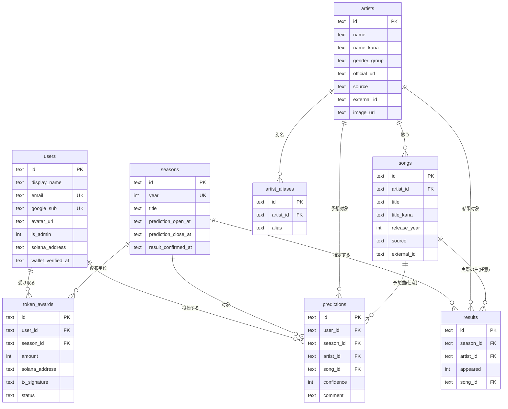

# DBテーブル定義書

紅白予想アプリの永続データ。Cloudflare D1（SQLite）上に Drizzle ORM で定義する。
スキーマの正は [`server/src/db/schema.ts`](../server/src/db/schema.ts)、適用済みSQLは
[`server/drizzle/`](../server/drizzle/) のマイグレーション。

## 1. 共通方針（型ルール）

- **主キー `id`**: 全テーブル UUID 文字列（`TEXT`）。アプリ側で `crypto.randomUUID()` を発番する。
  URL/APIに露出するため連番による推測を防ぐ。
- **日時**: `created_at` / `updated_at` ほか日時系は **UTCのISO8601文字列（`TEXT`）**。
  文字列の辞書順がそのまま時系列順になる。アプリ側で `new Date().toISOString()` を既定値にする。
- **外部キー**: 参照先の `id`（`TEXT`）に揃える。
- **真偽値**: SQLite に合わせ `INTEGER`（0/1）。Drizzle では `mode: "boolean"` で扱う。

## 2. ER図



> すべての外部キーは `ON DELETE CASCADE`。ただし `predictions.song_id` / `results.song_id` は
> `ON DELETE SET NULL`（曲が消えても予想/結果の行自体は残す）。

---

## 3. テーブル定義

各テーブルとも `created_at` / `updated_at`（`TEXT NOT NULL`, ISO8601/UTC）を持つため、以下では省略する。

### 3.1 users（ユーザー）

Google認証で識別するアプリ利用者。

| カラム             | 型      | NULL | 既定 | 制約・説明                                           |
| ------------------ | ------- | ---- | ---- | ---------------------------------------------------- |
| id                 | TEXT    | NO   | UUID | 主キー                                               |
| display_name       | TEXT    | NO   |      | 表示名（Google由来。本人が変更可）                   |
| email              | TEXT    | NO   |      | Googleアカウントのメール。**UNIQUE**                 |
| google_sub         | TEXT    | NO   |      | Googleの `sub`。**UNIQUE**。同一人物の照合キー（正） |
| avatar_url         | TEXT    | YES  |      | プロフィール画像URL                                  |
| is_admin           | INTEGER | NO   | 0    | 管理者フラグ（0/1）                                  |
| solana_address     | TEXT    | YES  |      | 記念トークン送付先。署名で所有確認後に設定           |
| wallet_verified_at | TEXT    | YES  |      | ウォレット所有を確認した時刻                         |

### 3.2 artists（アーティスト）

| カラム       | 型   | NULL | 既定 | 制約・説明                                                     |
| ------------ | ---- | ---- | ---- | -------------------------------------------------------------- |
| id           | TEXT | NO   | UUID | 主キー                                                         |
| name         | TEXT | NO   |      | 名称                                                           |
| name_kana    | TEXT | YES  |      | かな（かな違い検索用）                                         |
| gender_group | TEXT | YES  |      | 紅組/白組などの区分                                            |
| official_url | TEXT | YES  |      | 公式URL                                                        |
| source       | TEXT | YES  |      | 外部DB由来の出所（`spotify` / `musicbrainz`）。手動登録は NULL |
| external_id  | TEXT | YES  |      | `source` 内での外部ID。手動登録は NULL                         |
| image_url    | TEXT | YES  |      | 画像URL（主に Spotify）                                        |

- **UNIQUE**: `(source, external_id)` … 同一の外部アーティストを1行に集約する。
  SQLite では NULL 同士は別物扱いのため、手動登録（両方NULL）の行は重複しない。
- 外部から予想された際は `(source, external_id)` をキーに **find-or-create（遅延アップサート）** する。

### 3.3 artist_aliases（別名）

別名（例: 米津玄師 = ハチ / Kenshi Yonezu）を1行ずつ保持し、別名でも部分一致検索できるようにする。

| カラム    | 型   | NULL | 既定 | 制約・説明                  |
| --------- | ---- | ---- | ---- | --------------------------- |
| id        | TEXT | NO   | UUID | 主キー                      |
| artist_id | TEXT | NO   |      | → artists.id（**CASCADE**） |
| alias     | TEXT | NO   |      | 別名                        |

### 3.4 songs（曲）

| カラム       | 型      | NULL | 既定 | 制約・説明                           |
| ------------ | ------- | ---- | ---- | ------------------------------------ |
| id           | TEXT    | NO   | UUID | 主キー                               |
| artist_id    | TEXT    | NO   |      | → artists.id（**CASCADE**）          |
| title        | TEXT    | NO   |      | 曲名                                 |
| title_kana   | TEXT    | YES  |      | かな（かな違い検索用）               |
| release_year | INTEGER | YES  |      | リリース年                           |
| source       | TEXT    | YES  |      | 外部DB由来の出所（artists と同方針） |
| external_id  | TEXT    | YES  |      | 外部ID                               |

- **UNIQUE**: `(source, external_id)` … 同一の外部曲を1行に集約。手動登録の重複は起きない。

### 3.5 seasons（シーズン＝年度）

| カラム              | 型      | NULL | 既定 | 制約・説明                                                              |
| ------------------- | ------- | ---- | ---- | ----------------------------------------------------------------------- |
| id                  | TEXT    | NO   | UUID | 主キー                                                                  |
| year                | INTEGER | NO   |      | 年度。**UNIQUE**                                                        |
| title               | TEXT    | YES  |      | タイトル                                                                |
| prediction_open_at  | TEXT    | YES  |      | 受付開始。早押し係数の基準。NULLなら早押しボーナス無効                  |
| prediction_close_at | TEXT    | YES  |      | **締切＝公式発表の日時**。NULL=受付中。運営が後から設定（過去日時も可） |
| result_confirmed_at | TEXT    | YES  |      | 結果確定時刻                                                            |

### 3.6 predictions（予想）

| カラム     | 型      | NULL | 既定 | 制約・説明                                                      |
| ---------- | ------- | ---- | ---- | --------------------------------------------------------------- |
| id         | TEXT    | NO   | UUID | 主キー                                                          |
| user_id    | TEXT    | NO   |      | → users.id（**CASCADE**）                                       |
| season_id  | TEXT    | NO   |      | → seasons.id（**CASCADE**）                                     |
| artist_id  | TEXT    | NO   |      | → artists.id（**CASCADE**）                                     |
| song_id    | TEXT    | YES  |      | → songs.id（**SET NULL**）。NULL=出場予想のみ                   |
| confidence | INTEGER | NO   |      | 確信度 1〜5（範囲は Zod で検証）。MVPでは採点に影響しない表示用 |
| comment    | TEXT    | YES  |      | 任意コメント（最大500文字）                                     |

- **UNIQUE**: `(user_id, season_id, artist_id)` … 同一ユーザーが同一シーズンで同じアーティストを二重予想できない。
  サービス層でも事前チェックし 409 を返す。
- 採点・有効性の判定は `updated_at`（最後に内容を変えた時刻）で行う。

### 3.7 results（公式結果）

公式結果という「事実」を保持する。点数は持たず、予想×結果の突合で算出する。

| カラム    | 型      | NULL | 既定 | 制約・説明                                                                     |
| --------- | ------- | ---- | ---- | ------------------------------------------------------------------------------ |
| id        | TEXT    | NO   | UUID | 主キー                                                                         |
| season_id | TEXT    | NO   |      | → seasons.id（**CASCADE**）                                                    |
| artist_id | TEXT    | NO   |      | → artists.id（**CASCADE**）                                                    |
| appeared  | INTEGER | NO   |      | 出場したか（0/1）                                                              |
| song_id   | TEXT    | YES  |      | → songs.id（**SET NULL**）。出場し曲が判明した場合のみ。`appeared=0` なら NULL |

- **UNIQUE**: `(season_id, artist_id)` … 同一シーズン・同一アーティストの結果は1行のみ。
- 結果確定は冪等（同じ `(season_id, artist_id)` は upsert で更新）。

### 3.8 token_awards（記念トークン配布記録）

二重配布を防ぐための冪等性の台帳。

| カラム         | 型      | NULL | 既定      | 制約・説明                                     |
| -------------- | ------- | ---- | --------- | ---------------------------------------------- |
| id             | TEXT    | NO   | UUID      | 主キー                                         |
| user_id        | TEXT    | NO   |           | → users.id（**CASCADE**）                      |
| season_id      | TEXT    | NO   |           | → seasons.id（**CASCADE**）                    |
| amount         | INTEGER | NO   |           | 配布枚数（＝そのシーズンの合計スコア）         |
| solana_address | TEXT    | NO   |           | 配布時点の送付先                               |
| tx_signature   | TEXT    | YES  |           | Solanaのトランザクション署名（送信成功で設定） |
| status         | TEXT    | NO   | `pending` | `pending` / `sent` / `failed`                  |

- **UNIQUE**: `(user_id, season_id)` … 同一ユーザー・同一シーズンへの配布は1回のみ（再実行しても重複しない）。

---

## 4. インデックス一覧

| 名前                               | テーブル     | カラム                          | 種別   |
| ---------------------------------- | ------------ | ------------------------------- | ------ |
| users_email_unique                 | users        | email                           | UNIQUE |
| users_google_sub_unique            | users        | google_sub                      | UNIQUE |
| artists_source_external_unq        | artists      | (source, external_id)           | UNIQUE |
| songs_source_external_unq          | songs        | (source, external_id)           | UNIQUE |
| seasons_year_unique                | seasons      | year                            | UNIQUE |
| predictions_user_season_artist_unq | predictions  | (user_id, season_id, artist_id) | UNIQUE |
| results_season_artist_unq          | results      | (season_id, artist_id)          | UNIQUE |
| token_awards_user_season_unq       | token_awards | (user_id, season_id)            | UNIQUE |

## 5. マイグレーション履歴

drizzle-kit が生成（`server/drizzle/`）。`_journal.json` が適用順の正。

| tag                         | 内容                                                                                       |
| --------------------------- | ------------------------------------------------------------------------------------------ |
| 0000_red_captain_universe   | 初期スキーマ（users / artists / artist_aliases / songs / seasons / predictions / results） |
| 0001_big_wrecking_crew      | `token_awards` 追加、`users` に `solana_address` / `wallet_verified_at` 追加               |
| 0002_minor_mikhail_rasputin | `artists`・`songs` に外部DB由来カラム（source / external_id / image_url）と UNIQUE 追加    |

運用コマンド（`server/`）:

```bash
pnpm db:generate        # schema.ts の変更からマイグレーション生成
pnpm db:migrate:local   # ローカルD1へ適用
pnpm db:migrate:remote  # 本番D1へ適用
pnpm db:seed:local      # サンプルデータ投入（seed.sql）
```

## 6. 検索に関する設計補足

D1（SQLite）には `pg_trgm` のような類似検索が無いため、**高度なあいまい検索は持たない**。
表記揺れだけを吸収した部分一致を提供する（`domain/search.ts`）:

- 検索クエリ・対象ともに **NFKC正規化 → 小文字化 → カタカナをひらがな化 → 空白除去** してから部分一致。
- 対象カラム: artists(`name`, `name_kana`) / artist_aliases(`alias`) / songs(`title`, `title_kana`)。
- データ件数が小さい前提で、候補を読み込みアプリ側で照合する。将来必要なら FTS5 を検討する。
